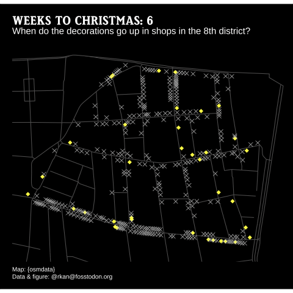
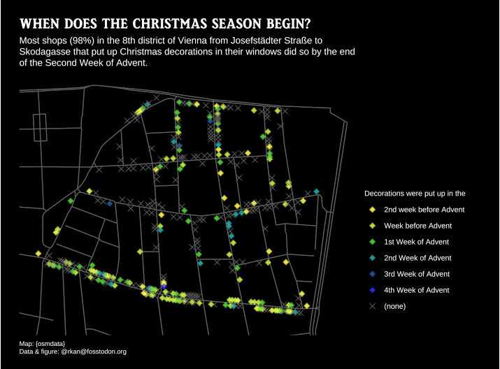
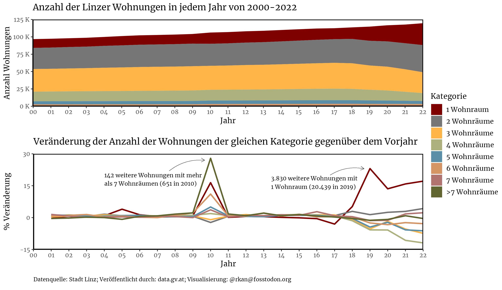
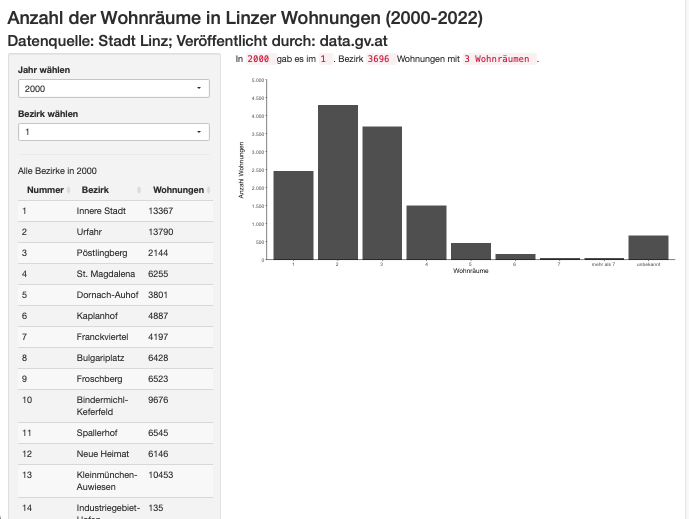
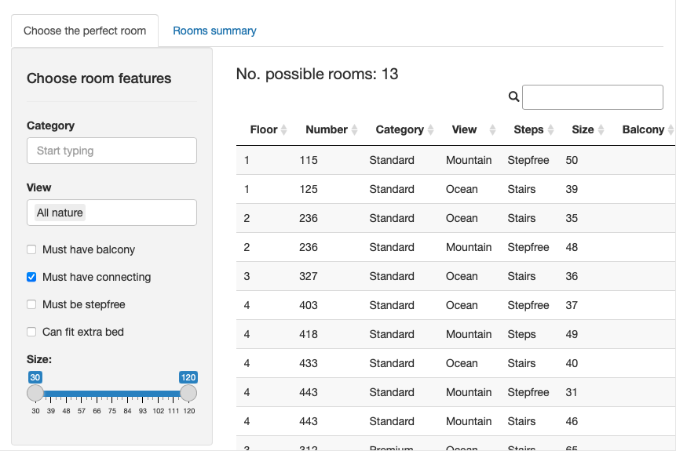
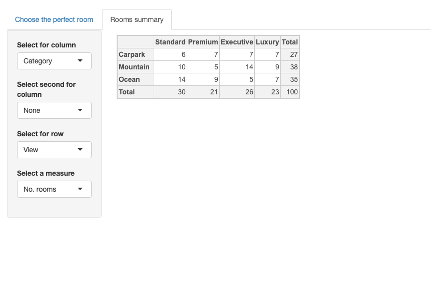

Figures about Austria. In progress and open to comments. 

## Christmas2022
Map of 8th District of Vienna showing when Christmas decorations went up in shop windows. I walked the ~9km to collect the data; the location of each shop was geo-referenced in QGIS. The gif seems to be more suitable for representing the date/time factor. See code for more details.

  
  

## Linzer Wohnungen
Flats in Linz from 2000-2022 according to number of rooms. Data from Stadt Linz and is downloaded at the start of the code. Area plot shows number of rooms and line plot shows percentage change in number of rooms compared to previous year. 

[Shiny app (second image) built on the same data here. ]( https://rkan0.shinyapps.io/Linz_Wohnung/)Code for app in folder. 

  
    
    

## Hotel room selector

Shiny app to view a list of rooms in a hotel filtered by selected room features. Second tab builds a contingency/pivot table based on room features. 

  
  

